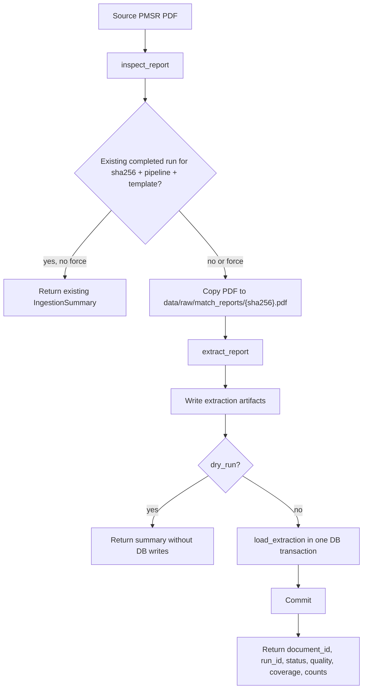
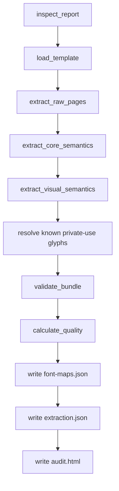

# FIFA PMSR ingestion flow

This document explains how the FIFA post-match summary report ingestion path works for PDFs handled by `world_cup_api.pipelines.fifa_pmsr`.

The pipeline has two related but separate jobs:

1. Extract a PDF into lossless artifacts and normalized analytical records.
2. Ingest those artifacts into the application SQLite database as an immutable, versioned extraction run.

The main entrypoints are:

- CLI: `world-cup-report ingest FILE`
- Python: `ingest_report(session, path, force=False, dry_run=False)`
- Lower-level extraction: `extract_report(path, artifact_root, template="auto")`
- Lower-level database load: `load_extraction(session, bundle)`

## High-level flow



## Stage 1: Inspection

`inspect_report(path)` performs the first deterministic pass over the PDF.

It does not write to the database. It returns a `DocumentManifest` containing:

- absolute source path
- filename
- SHA-256 content hash
- file size
- page count
- page sizes
- encrypted flag
- PDF version and metadata
- detected template key/version/confidence
- cover-page match metadata when detectable:
  - official match number
  - home and away teams
  - score
  - match date
  - kickoff time
  - venue

Template detection currently checks:

- page dimensions against the registered template size
- required anchor text across the document
- expected page count

If confidence is below the threshold, `template_key` remains `null`. The extraction may still preserve raw payloads, but validation will add a blocking `template_not_recognized` issue.

## Stage 2: Idempotency check

`ingest_report` uses the manifest hash as the document identity.

Before doing expensive work, it checks for an existing `match_report_documents` row with the same SHA-256. If found, it then checks for a completed `match_report_extraction_runs` row with:

- same document
- current `PIPELINE_VERSION`
- same template version
- status `completed`

If that run exists and `force=False`, ingestion reuses it and returns an `IngestionSummary` with `reused=True`.

This means:

- running the same file twice does not duplicate completed data
- changing the pipeline version creates a new extraction lineage
- `--force` creates a new attempt even for the same PDF

## Stage 3: Raw PDF storage

If the run is not reused, `ingest_report` copies the source PDF to:

```text
data/raw/match_reports/{sha256}.pdf
```

This path is content-addressed. The same PDF bytes always map to the same raw path.

The copied raw file becomes the canonical source for extraction. The bundle manifest is updated so `source_path` points at the raw content-addressed file, not the user’s original location.

## Stage 4: Extraction bundle creation

`extract_report(raw_path, artifact_root)` builds an `ExtractionBundle`.

The artifact root is:

```text
data/processed/match_reports/{sha256_prefix}/fifa-pmsr-v1/
```

The current flow inside `extract_report` is:



### 4.1 Raw page extraction

`extract_raw_pages` captures every page as a `RawPage`.

For each page, the pipeline stores:

- page number
- page width and height in PDF points
- page rotation
- raw text
- deterministic rendered page URI and checksum
- page classification
- payload arrays grouped by low-level type

The low-level payload arrays include:

- glyphs / characters
- text spans / words
- table cells
- vector primitives
- embedded images and image geometry

Every low-level element gets:

- a stable page-scoped element ID
- source coordinates or bounding box where available
- raw attributes from the PDF parser
- a classification:
  - `mapped`
  - `decorative`
  - `unresolved`
- a `mapped_by` reason when mapped or decorative

The invariant is: no raw element should silently disappear.

### 4.2 Page classification

Pages are classified from extracted content rather than trusted only by page number.

The resulting classification is stored on each `RawPage`:

- `page_type`
- `section`
- `team_scope`
- classifier confidence
- matched anchors

This classification controls downstream extractors and also determines whether some visuals are analytical or decorative.

### 4.3 Core semantic extraction

`extract_core_semantics` reads text and table-like structures and emits normalized records for:

- participants
- scalar observations
- player/team table values
- physical values
- directed pass-network edges
- text/table-derived events
- extraction issues

The core extraction output is still provenance-first. Each semantic record carries:

- page number
- source element IDs
- source bounding box where available
- method
- confidence
- team/player source names before database linking

### 4.4 Visual semantic extraction

`extract_visual_semantics` converts analytical visuals into numeric data.

It consumes:

- raw page payloads
- attempt details from the core extractor
- participant records

It emits:

- events with spatial coordinates
- spatial features
- time-series points
- visual extraction issues

Examples:

| PDF visual | Normalized result |
| --- | --- |
| Shot map dot | `match_report_events` row with raw/page/pitch coordinates |
| Goal-mouth target | linked event/geometry in normalized goal-mouth space |
| Cross or goalkeeper arrow | start/end coordinates, length, angle, outcome attributes |
| Formation diagram | player points plus formation/team spatial features |
| Pitch zones | polygons with zone/category/count attributes |
| Goalkeeper timeline | ordered `match_report_timeseries_points` |
| Pass matrix | directed `match_report_network_edges` from table extraction |

The pipeline keeps both the derived numeric values and the original geometry evidence.

## Stage 5: Glyph decoding and OCR policy

Some FIFA PMSR physical tables use private-use glyphs for digits and punctuation.

The pipeline handles these by:

1. Capturing private-use glyphs as raw glyph payloads.
2. Marking unknown private-use glyphs as `unresolved` initially.
3. Applying the known FIFA PMSR private-use digit and typography maps.
4. Writing reusable `font-maps.json` artifacts.
5. Falling back to targeted OCR only where needed.

Full-page OCR is intentionally not part of the normal ingestion path. OCR should be targeted to a cell or bounding box so it can be audited.

## Stage 6: Validation and quality scoring

`validate_bundle(bundle)` adds issues for failed invariants.

Current validations include:

- template must be recognized
- extracted page count must match manifest page count
- no page should remain `unknown`
- every low-level artifact must have a valid classification
- unresolved raw artifacts become review warnings
- required match metadata must be extracted
- lineup participant count must be plausible
- passing network must not be empty
- goalkeeper timeline must not be empty
- physical table extraction must be sufficiently complete
- the Match 29 golden physical value must decode correctly: Alisson total distance `5530.5`

`calculate_quality(bundle)` computes:

- raw coverage: `(mapped + decorative) / total low-level elements`
- quality score: weighted template confidence and coverage, penalized by errors/warnings

Promotion policy:

- `completed`: quality is at least `0.80` and no error issues exist
- `needs_review`: quality is too low or at least one error issue exists

Important: `needs_review` does not mean extraction data is thrown away. Raw payloads, artifacts, issues, and normalized records are still preserved so the run can be audited.

## Stage 7: Artifact writing

Each extraction writes a versioned artifact directory.

Expected files include:

```text
data/processed/match_reports/{sha256_prefix}/fifa-pmsr-v1/
├── extraction.json
├── audit.html
├── font-maps.json
├── renders/
│   └── page-001.png
└── images/
    └── ...
```

`extraction.json` is the serialized `ExtractionBundle`.

`audit.html` is the human review artifact. It contains page-level summaries, classifier output, counts, confidence, and issues.

`font-maps.json` records private-use glyph decoding evidence.

Rendered pages and extracted images are data artifacts and should stay out of Git.

## Stage 8: Dry-run behavior

When `world-cup-report ingest FILE --dry-run` is used, the pipeline still:

- inspects the PDF
- copies it to the raw content-addressed location if needed
- extracts raw and semantic artifacts
- writes `extraction.json`, `audit.html`, renders, images, and font maps
- computes quality, coverage, counts, and issues

It does not call `load_extraction`, and it does not commit any database changes.

The returned `IngestionSummary` has `dry_run=True` and no `document_id` or `extraction_run_id`.

## Stage 9: Database load

`load_extraction(session, bundle)` persists the bundle into the current SQLAlchemy transaction.

It expects the caller to commit or rollback. `ingest_report` owns that transaction boundary and rolls back the full load if any exception is raised.

The load order is deliberate:

1. Resolve existing application teams.
2. Resolve the report to an existing `matches` row when possible.
3. Create or update `match_report_documents`.
4. Mark prior extraction runs for the same document inactive.
5. Create a new `match_report_extraction_runs` attempt.
6. Insert pages and preserve page IDs.
7. Insert per-page raw payloads.
8. Link participants to teams and squad players when possible.
9. Insert metric definitions on demand.
10. Insert observations.
11. Insert events.
12. Insert spatial features.
13. Insert network edges.
14. Insert time-series points.
15. Insert issues.
16. Update document status and raw PDF URI.
17. Flush and return the run.

### Document rows

`match_report_documents` stores one logical source document per SHA-256 hash.

It includes:

- document UUID
- SHA-256
- filename
- source/raw path
- file size
- linked match ID when resolved
- official match number
- template key/version
- page count
- PDF metadata
- current document status

### Extraction run rows

`match_report_extraction_runs` stores immutable attempts.

Each run includes:

- run UUID
- document ID
- pipeline version
- template version
- attempt number
- status
- quality score
- coverage
- artifact root
- stats JSON
- error JSON
- active flag
- completion timestamp

Only the newest loaded attempt is active. Prior attempts remain in the database for auditability.

### Page and raw payload rows

For every page:

- `match_report_pages` stores page metadata, classification, raw text, rendered page URI/checksum, and raw element count.
- `match_report_page_payloads` stores the complete low-level arrays by payload type.

Each payload row also stores:

- total element count
- mapped count
- decorative count
- unresolved count
- checksum

This is the lossless bridge from PDF source evidence to normalized analytical records.

### Participant linking

`match_report_participants` stores the names and shirt numbers from the PDF first.

Then the loader attempts to link to existing application data:

- team link by normalized team name, short name, or FIFA code
- squad-player link by `(team_id, squad_number)`

This makes the original report identity available even if canonical linkage fails.

### Metric definitions and observations

Before inserting each observation, the loader ensures a `match_report_metric_definitions` row exists.

Observations go into `match_report_observations` and can represent:

- match-level values
- team-level values
- player-level values
- table-cell values
- document-level values

Each observation preserves:

- numeric value and/or text value
- unit
- period/phase
- dimensions JSON
- explicit-zero flag
- blank/null flag
- source bbox and element IDs
- method and confidence

### Events

`match_report_events` stores timestamped and/or spatial football actions:

- attempts
- crosses
- substitutions
- cards
- pressures
- regains
- goalkeeper actions
- any other supported event type

Spatial fields include:

- raw start/end coordinates
- normalized page coordinates
- canonical pitch coordinates in metres
- coordinate space
- attacking direction
- length
- angle
- attributes JSON

### Spatial features

`match_report_spatial_features` stores geometries that are not necessarily one event:

- formation points and summaries
- pitch zones
- line extents
- polygons
- goal-mouth geometries
- other analytical shapes

Each row keeps raw, normalized, and canonical geometry JSON when available.

### Network edges

`match_report_network_edges` stores directed player-to-player passing data:

- source player
- target player
- pass count
- pass share
- linked source and target participants when resolved
- source bbox and element IDs

### Time-series points

`match_report_timeseries_points` stores calibrated chart/timeline points:

- series key
- team/player
- period
- minute
- match second
- value
- unit
- raw chart coordinates
- source element IDs

### Issues

`match_report_issues` is the review queue.

It stores:

- severity
- code
- message
- artifact type
- source bbox
- source element IDs
- evidence JSON
- unresolved/resolved state

The design goal is that questionable data becomes reviewable evidence, not missing data.

## Transaction semantics

`ingest_report` wraps `load_extraction` in a single transaction:

```text
try:
    run = load_extraction(session, bundle)
    session.commit()
except Exception:
    session.rollback()
    raise
```

So a failed load cannot leave a partial extraction run in the database.

`extract_report` artifacts may still exist on disk after a failed DB load. That is intentional: artifacts are useful for debugging and can be loaded later from `extraction.json`.

## Batch ingestion

`world-cup-report batch DIRECTORY --glob "*.pdf" --workers 4` separates extraction from database loading:

1. Find matching PDFs.
2. Extract PDFs concurrently with a `ProcessPoolExecutor`.
3. Write one `extraction.json` per PDF.
4. Open one database session.
5. Load each bundle sequentially.
6. Commit after each loaded bundle.
7. Report loaded document/run IDs and extraction failures.

This avoids concurrent SQLite writes while still parallelizing CPU/PDF extraction.

## Validation after ingestion

`world-cup-report validate DOCUMENT_ID` validates a persisted active extraction.

Use it when you need to verify database state after ingestion rather than only validating the in-memory bundle.

The persisted validation should be used as the acceptance gate before treating a report as analytically trusted.

## Export flow

`world-cup-report export DOCUMENT_ID --format jsonl|parquet` reads the active extraction run for a document and writes table-shaped datasets.

Exported datasets:

- `documents`
- `extraction_runs`
- `pages`
- `page_payloads`
- `participants`
- `observations`
- `events`
- `spatial_features`
- `network_edges`
- `timeseries_points`
- `issues`

JSONL preserves nested JSON fields as JSON values.

Parquet serializes nested dict/list fields as JSON strings and uses Zstandard compression.

## Common operational commands

Inspect without writing artifacts or DB rows:

```bash
cd /Users/mberlanga/Documents/WC/backend
uv run world-cup-report inspect /Users/mberlanga/Documents/wcreports/PMSR-M29-BRA-V-HAI.pdf
```

Extract artifacts only:

```bash
cd /Users/mberlanga/Documents/WC/backend
uv run world-cup-report extract /Users/mberlanga/Documents/wcreports/PMSR-M29-BRA-V-HAI.pdf \
  --output /Users/mberlanga/Documents/WC/data/processed/match_reports
```

Dry-run full ingestion without DB writes:

```bash
cd /Users/mberlanga/Documents/WC/backend
uv run world-cup-report ingest /Users/mberlanga/Documents/wcreports/PMSR-M29-BRA-V-HAI.pdf --dry-run
```

Ingest into the application database:

```bash
cd /Users/mberlanga/Documents/WC/backend
uv run world-cup-report ingest /Users/mberlanga/Documents/wcreports/PMSR-M29-BRA-V-HAI.pdf
```

Force a new attempt for the same source PDF:

```bash
cd /Users/mberlanga/Documents/WC/backend
uv run world-cup-report ingest /Users/mberlanga/Documents/wcreports/PMSR-M29-BRA-V-HAI.pdf --force
```

Validate the active extraction:

```bash
cd /Users/mberlanga/Documents/WC/backend
uv run world-cup-report validate DOCUMENT_ID
```

Export normalized datasets:

```bash
cd /Users/mberlanga/Documents/WC/backend
uv run world-cup-report export DOCUMENT_ID --format jsonl
uv run world-cup-report export DOCUMENT_ID --format parquet
```

## Status meanings

| Status | Meaning |
| --- | --- |
| `completed` | Extraction quality is high enough and no blocking invariant failed. |
| `needs_review` | Raw and normalized data were preserved, but one or more quality gates failed. |
| `failed` | Reserved for extraction/load failures that prevent a usable bundle. |

## Failure and review behavior

The pipeline is intentionally conservative:

- Unknown page types become validation errors.
- Unresolved low-level artifacts become review warnings.
- Missing required match metadata blocks completion.
- Missing pass networks, timelines, or physical values block completion.
- Visual/text disagreements should become issues, not silent corrections.
- Source evidence remains available through page payloads, source element IDs, bboxes, rendered pages, and `audit.html`.

The correct response to `needs_review` is to inspect `audit.html`, fix the extractor/template/font map if appropriate, and rerun with `--force`.

## Where to change ingestion behavior

Use these files as the main maintenance map:

| Concern | File |
| --- | --- |
| CLI commands | `backend/src/world_cup_api/pipelines/fifa_pmsr/cli.py` |
| End-to-end ingest orchestration | `backend/src/world_cup_api/pipelines/fifa_pmsr/service.py` |
| PDF inspection/template detection | `backend/src/world_cup_api/pipelines/fifa_pmsr/inspect.py` |
| Raw PDF extraction/rendering | `backend/src/world_cup_api/pipelines/fifa_pmsr/raw.py`, `render.py` |
| Extraction bundle assembly | `backend/src/world_cup_api/pipelines/fifa_pmsr/extract.py` |
| Core text/table extraction | `backend/src/world_cup_api/pipelines/fifa_pmsr/extractors/core.py` |
| Visual-to-numeric extraction | `backend/src/world_cup_api/pipelines/fifa_pmsr/extractors/visual.py` |
| Coordinate normalization | `backend/src/world_cup_api/pipelines/fifa_pmsr/coordinates.py` |
| Quality gates | `backend/src/world_cup_api/pipelines/fifa_pmsr/validate.py` |
| Database persistence | `backend/src/world_cup_api/pipelines/fifa_pmsr/loader.py` |
| Export | `backend/src/world_cup_api/pipelines/fifa_pmsr/export.py` |
| SQLAlchemy report tables | `backend/src/world_cup_api/db/report_models.py` |

## Key invariants

- The SHA-256 hash is the canonical source-document identity.
- A completed run is reused unless `force=True`.
- Re-extraction creates a new extraction run attempt rather than overwriting prior run data.
- Only one run per document is active after loading.
- Raw PDFs and extraction artifacts are content/version addressed.
- Database persistence is transactional.
- Every normalized record points back to page/source evidence.
- Every raw element must be classified as mapped, decorative, or unresolved.
- Analytical use should depend on `completed` status or an explicit reviewed exception.
